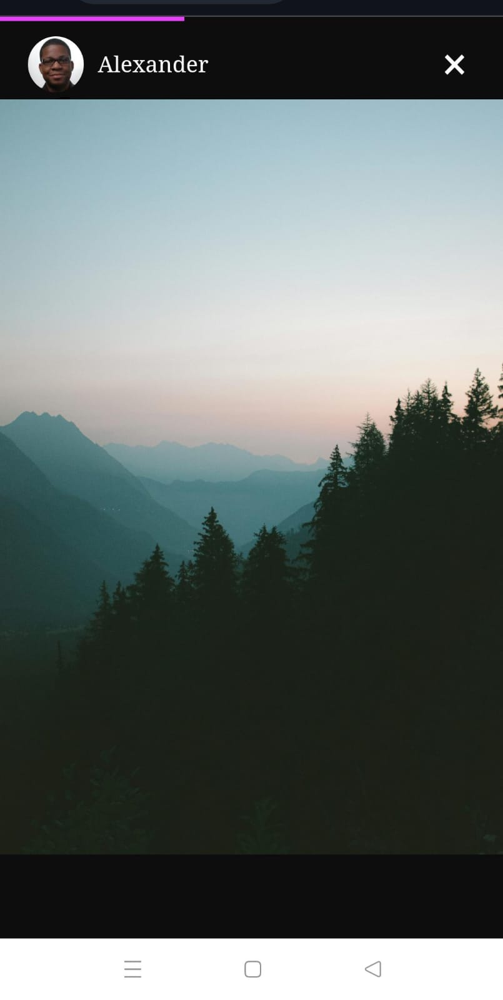

# Story Viewer - customized for phone

A mobile-only story viewer application built with React.js and TypeScript. It features a horizontally scrollable list of stories fetched from an external source -> StoryData , with smooth transitions, manual and automatic navigation, and end-to-end testing using Playwright.

---

## Project Overview

This project implements a mobile-first story viewer similar to Instagram Stories. Users can scroll through a list of story thumbnails, tap to open a story, and navigate between stories either manually or automatically after 5 seconds. The app handles image loading states and uses CSS animations for smooth transitions. Core functionality avoids external libraries to keep the codebase lightweight and maintainable.

---

## Features

- Mobile-optimized UI for story viewing
- Horizontally scrollable list of story thumbnails
- Manual navigation by tapping the left or right side of the story view
- Automatic story advance every 5 seconds
- Loading indicators during image fetch
- Smooth fade-in/fade-out animations for story transitions
- End-to-end tests written with Playwright to validate core user flows

---

## Tech Stack

- React.js with TypeScript
- Playwright for end-to-end testing
- CSS animations and transitions for UI effects

---

## Getting Started

### Prerequisites

- Node.js (version 16 or above recommended)

### Installation

1. Clone this repository:

   ```bash
   git clone https://github.com/anshu-kumar27/Insta_Story
   cd ./Insta_Story
   npm install
   ```
   
1. Clone this repository:

   ```bash
   git clone https://github.com/anshu-kumar27/Insta_Story
   cd ./Insta_Story
   npm install
   ```
   
1. Clone this repository:

   ```bash
   git clone https://github.com/anshu-kumar27/Insta_Story
   cd ./Insta_Story
   npm install
   ```
   
1. Clone this repository:

   ```bash
   git clone https://github.com/anshu-kumar27/Insta_Story
   cd ./Insta_Story
   npm install
   ```
   
1. Clone this repository:

   ```bash
   git clone https://github.com/anshu-kumar27/Insta_Story
   cd ./Insta_Story
   npm install
   ```
   
1. Clone this repository:

   ```bash
   git clone https://github.com/anshu-kumar27/Insta_Story
   cd ./Insta_Story
   ```

2. Install dependencies And Run:

   ```bash
   npm install
   npx playwright install
   npm run dev
   ```

3. PlayWright Testing:

   ```bash
   npx playwright test
   ```

## File Structure
```
  /src
    /components
      Stories.tsx -> All the user details are mapped to the skeleton
      StoriesSkeleton.tsx -> preview of all the users (onclick will result in opening the story)
      /viewStory (in this folder the structure of story view is defined with all the logics)
        StoryView.tsx 
        imageLoad.ts
    /data
      StoryData.ts -> all the data related to user's story, name , avatar
    /styles
      imageLoading -> loading home screen animation
      story.css -> all the animation related to stories are here
    /loading
      ImageLoading.tsx -> home screen loading bar
    /utils
      Constants.ts -> all the constants like url and details (acting like a temporary env)
    /tests
      example.spec.ts -> for playwright testing
  
  playwright.config.ts
  package.json
  README.md
```
---

### Design Choices & Performance Optimizations
## UI & Layout
The entire UI is built using CSS Flexbox to ensure responsive, flexible, and mobile-friendly layouts without heavy dependencies. This approach guarantees smooth rendering and easy adaptability across different screen sizes, focusing on mobile as per the requirements.

## Media & Avatar Loading Handling
To enhance user experience, loading placeholders (skeletons and loaders) are shown while images and avatars are loading. This prevents any flicker display of incomplete or broken images, making transitions seamless and visually pleasant.

implement a loading timeout fallback to handle cases where images fail to load or take too long, ensuring the app does not hang indefinitely and maintains responsiveness.

## Story Viewing & Navigation Logic
1. Story previews and details are mapped to a skeleton component that displays the list of stories. Clicking a user activates a controlled index value to show the corresponding story.
2. Closing a story resets this index to null, which cleanly returns the user to the story list.
3. Clickable areas are positioned absolutely on the left and right sides of the story view. When the user taps the left area, the current story index decreases by 1, and when the right area is tapped, the index increases by 1.
4. To prevent out-of-bound errors (overflows): The left click only decreases the index if it is greater than 0, ensuring it never goes below the first story / The right click only increases the index if it is less than the total number of stories minus one (totalLength - 1), preventing it from exceeding the last story.

## Accurate Timing & Synchronization
1. We use performance.now() to track story start times precisely, improving the accuracy of story progression and pause/resume mechanics.
2. When the user pauses the story (e.g., pressing and holding), we record the pause time and calculate the exact elapsed time by subtracting the start time from the pause time.
3. The remaining display duration is recalculated by subtracting elapsed time from the total duration (5 seconds), ensuring the progress bar and story timer stay perfectly in sync.
4. All active timers are cleared before starting new ones to avoid timer overlap or race conditions that could cause inconsistent story transitions.
   
## Media Loading Optimization
1. Story timers and progress bars only start after the media (image) has fully loaded, guaranteeing users get the full 5 seconds of viewing time for the actual content, not the loading screen.
2. This optimization prevents premature story advancement and improves user engagement by ensuring content readiness before timing starts.

---

## 🖼️ Screenshots

Here are a few glimpses of the stories in action:

### 🏠 Homepage


### 🔍 Story View
